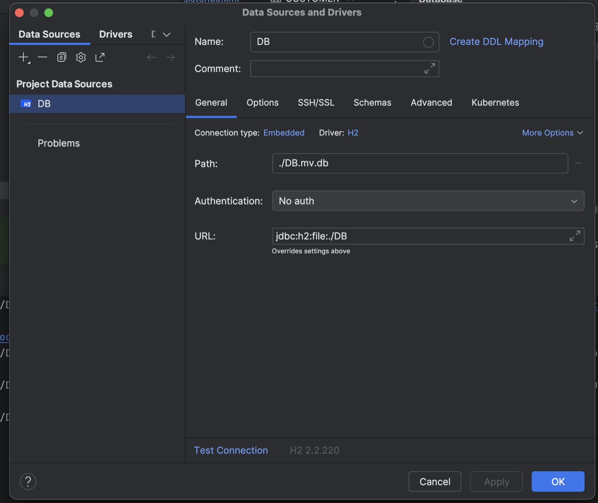
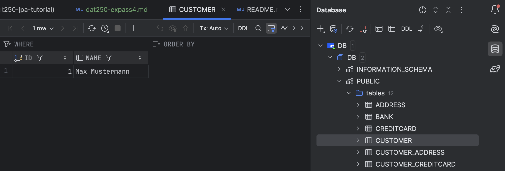

# Report on Experiment 2: Java Persistence Architecture (JPA)

## 1. Technical Problems Encountered and Resolutions

The step where I got most stuck was **inspecting the tables and diagrams of the database**. Initially, I tried accessing the database via `localhost:8082`, but I couldn't get the page to load or the H2 console to work correctly.

Finally, I decided to use **IntelliJ IDEA's database visualization tool**, and this worked perfectly (see point 3 for more details).

Additionally, I encountered two test failures that I had to resolve:
- **Test 1**: `assertEquals(address.getOwners(), Set.of(customer));`
- **Test 2**: `assertEquals(bank.getOwnedCards(), Set.of(firstCard, secondCard));`

Both tests were failing because I had originally defined the relationship collections as **Collection** instead of **Set**. After redefining these collections as `Set`, the tests passed successfully.

---

## 2. Code for Experiment 2

You can find the code for Experiment 2 in the following repository:

[GitHub Repository - Experiment 2](https://github.com/CarlaMiquelBlasco/dat250-jpa-tutorial/tree/master/src/main/java/no/hvl/dat250/jpa/tutorial/creditcards)

### 2.1. Explain the Used Database and How/When It Runs

The database used in this experiment is **H2 in file-based mode**. This configuration stores the database on the disk as a file (`DB.mv.db`), allowing the data to persist across application restarts.

The database runs automatically when the application starts and is connected via the following JDBC URL:

```
jdbc:h2:file:./DB;DB_CLOSE_DELAY=-1
```

- **DB_CLOSE_DELAY=-1**: Ensures that the database remains open for the lifetime of the JVM.

### 2.2. SQL Used to Create the Table `Customer`

Here is the SQL generated by Hibernate to create the `Customer` table:

```sql
create table Customer (
    id bigint generated by default as identity,
    name varchar(255),
    primary key (id)
);

create table customer_address (
    address_id bigint not null,
    customer_id bigint not null,
    primary key (address_id, customer_id)
);

create table customer_creditcard (
    creditcard_id bigint not null,
    customer_id bigint not null,
    primary key (creditcard_id, customer_id)
);
```

### 2.3. Inspecting the Database Tables and Schema

I inspected the tables using **IntelliJ IDEA's Database Tool**. After connecting to the **file-based H2 database** (`DB.mv.db`), I could view the tables that were generated by Hibernate and run queries directly within the tool.

The schema and the tables generated by Hibernate correspond to the entity relationships defined in the JPA model, including `Customer`, `Address`, `CreditCard`, `Bank`, `Pincode`, and the join tables for the many-to-many relationships.

---

## 3. Inspecting the Database Tables

To inspect the database tables, I used **IntelliJ IDEA's Database Tool**. I created a connection to the **H2 file-based database** (`jdbc:h2:file:./DB`) and was able to view the generated tables.

Here are the key tables that were created:
- **CUSTOMER**
- **ADDRESS**
- **CREDITCARD**
- **PINCODE**
- **BANK**
- **CUSTOMER_ADDRESS** (Join table)
- **CUSTOMER_CREDITCARD** (Join table)

### Screenshots

#### **Screenshot 1**: Database Connection Configuration



#### **Screenshot 2**: Schema of all the tables and data in Customer



---

## 4. Pending Issues and Further Steps

There are no major unresolved issues with this assignment. However, here are some areas for improvement:

- **Inspecting Database**: Find a way to inspect and modify Database from localhost url
- **Explore querying and testing**: Explore more advanced querying and management of the database and consider further testing to ensure that all entity relationships are working as expected, especially in more complex scenarios.

